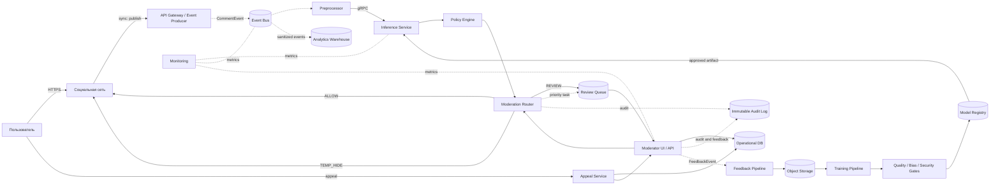
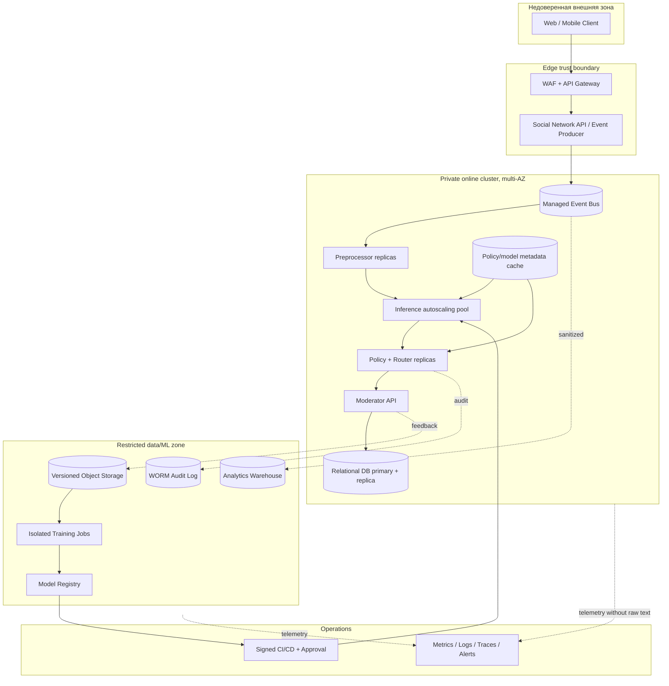

# Архитектура

## Online inference и offline training

Сплошные стрелки — синхронные HTTPS/gRPC вызовы, пунктирные — асинхронные события/пакеты. Online не зависит от доступности training-контура.

При timeout/error inference circuit breaker направляет событие в Policy Engine с `model_unavailable`; критические детерминированные правила сохраняются, прочие случаи — `REVIEW`. Подтверждённое событие не отбрасывается: retry, затем DLQ и алерт.

## Размещение и границы доверия

Доступ между зонами — allow-list, workload identity и mTLS. Модератор использует MFA/RBAC; pipeline обучения читает только утверждённые snapshots. Конкретный облачный вендор намеренно не закреплён.
