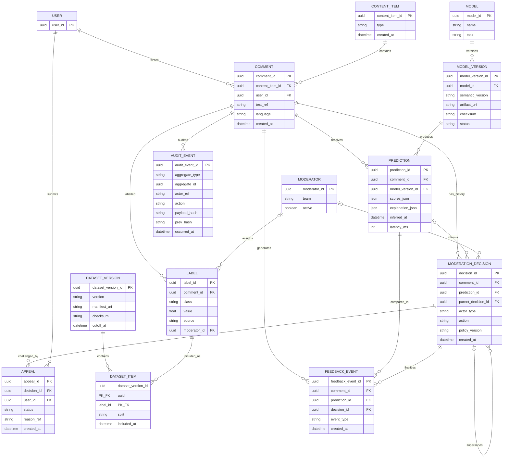

# Модель данных

Диаграмма показывает логические сущности и кардинальности. Чувствительность, типы и размещение полей описаны в [docs/05-data.md](../docs/05-data.md).

Операционная БД хранит workflow metadata, event bus — события, warehouse — обезличенные факты, object storage — raw по ссылке/датасеты/модели, audit store — append-only события. Текст не дублируется в Prediction, Decision или AuditEvent.
