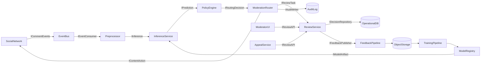
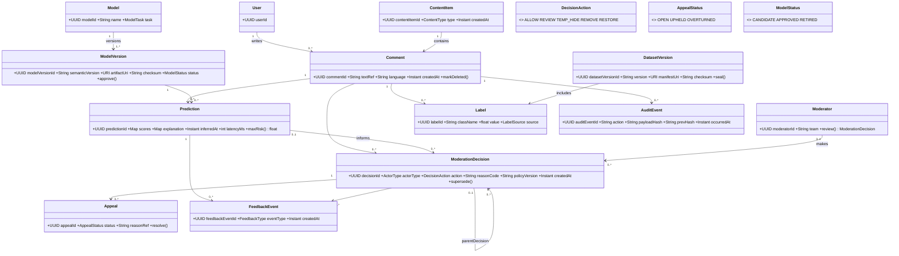
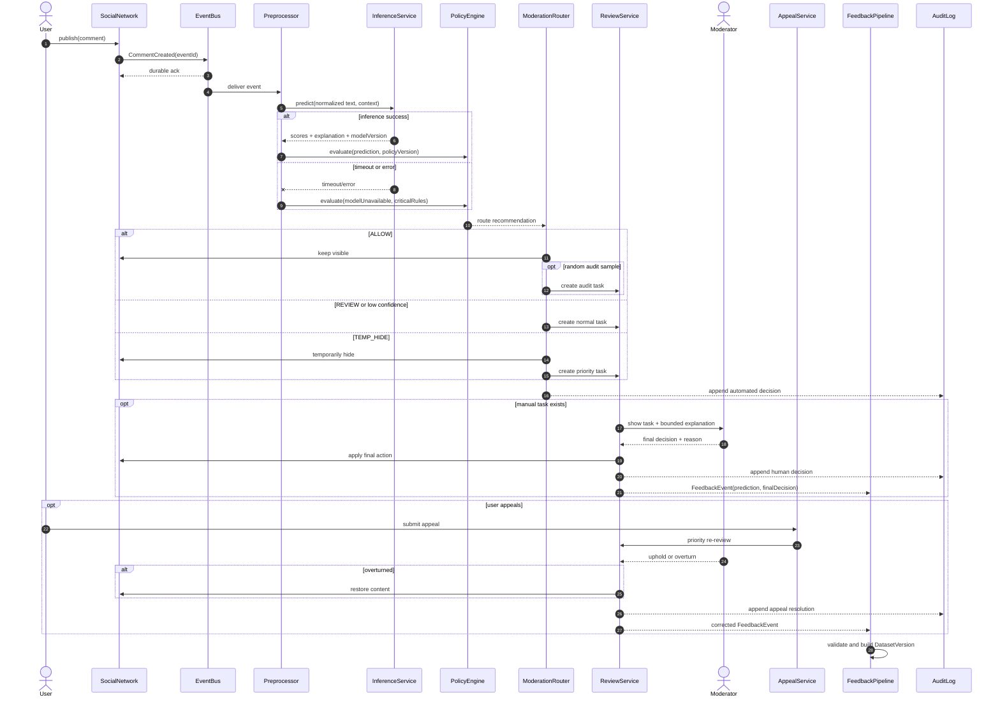

# UML-комплект

## Компонентная схема

Назначение: показать интерфейсы online-маршрута, проверки человеком, апелляции и ML lifecycle. Mermaid не реализует отдельный `componentDiagram`, поэтому используется эквивалентная компонентная схема.

## Диаграмма классов

Назначение: зафиксировать ключевые доменные типы. История решений реализована связью `parentDecision`; status апелляции и action решения — перечисления.

## Диаграмма последовательности

Назначение: обработка нового комментария, timeout модели, три маршрута, ручное решение, апелляция и feedback loop. Допущение: публикация подтверждается после durable enqueue; `TEMP_HIDE` обратим.

## Проверка согласованности

Имена `InferenceService`, `PolicyEngine`, `ModerationRouter`, `ReviewService`, `AppealService`, `FeedbackPipeline` совпадают с production-архитектурой. Доменные сущности совпадают с ER; дополнительные перечисления описывают статусы и не являются отдельными хранилищами.

